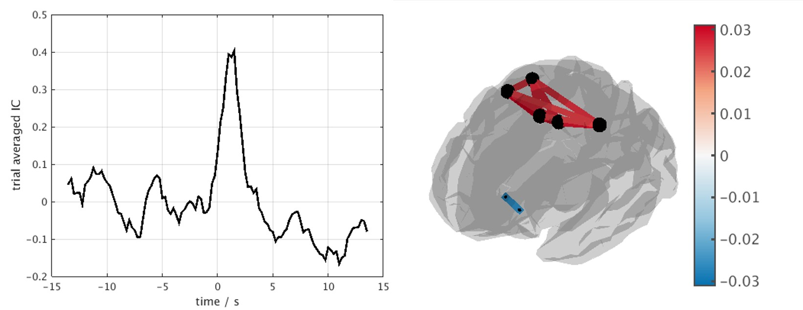

dynets 
======

A pipeline for exploring time evolving M/EEG networks, based on the paper _Measurement of dynamic task related functional networks using MEG (O'Neill et al; NeuroImage 2018)_ https://doi.org/10.1016/j.neuroimage.2016.08.061

## Compatibility
All you need is a relatively up-to-date version of Fieldtrip http://www.fieldtriptoolbox.org/ as this handles all the data preprocessing and source reconstruction for ease.

The code currently assumes you are giving it CTF data and a coregistered MRI file for source reconstruction. For those who want to use other manufacturers data, you will need to edit *go_generateAtlasFilters*.

# Differences between paper and code
Owing to the simultaneous flexibility and rigidity of Fieldtrip, there are some subtle differences between the above publication and this repository, namely:
* Forward modelling is via. Nolte's corrected sphere approach rather than Huang's local spheres approximation.
* Optimal weights are derived from Sekihara's eigenvalue decomposition, rather than explicit search. 
These changes should be to any detriment of the results. 

# Citation
Please cite the following paper if this code is of any benefit to yourself. 
> O’Neill G.C., Tewarie P.K., Colclough G.L., Gascoyne L.E., Hunt B.A.E., Morris P.G., Woolrich M.W., Brookes M.J., (2017) Measurement of dynamic task related functional networks using MEG. NeuroImage 146 pp. 667-78

